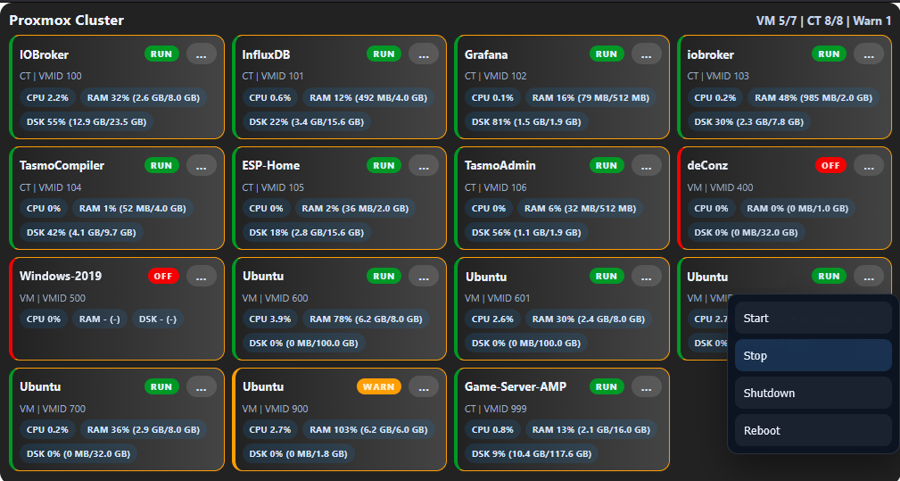

# ioBroker.vis-proxmox-widget

Installierbares Proxmox-Widget für `ioBroker.vis` / VIS-1.

Das Widget liest die vorhandenen Daten aus einer installierten `proxmox.x`-Instanz und zeigt VMs, Container, Nodes und optional Storage direkt in VIS an.

## Vorschau



## Funktionen

- direkte Nutzung der vorhandenen `proxmox.x`-Adapterdaten
- Anzeige von:
  - VMs
  - Containern
  - Nodes
  - optional Storage
- kompakte Übersicht mit:
  - Name
  - Typ
  - VMID
  - Laufzeit
  - CPU
  - RAM
  - Speicherplatz
- Kopfzeile mit Zusammenfassung wie `VM 5/7 | CT 8/8 | Warn 1`
- Statusaktionen direkt im Widget:
  - `Start`
  - `Stop`
  - `Shutdown`
  - `Reboot`
- Sortierung nach:
  - `Name`
  - `VMID`
  - `Status`
  - `CPU`
  - `RAM`
  - `Speicher`

## Anzeigeoptionen

- Proxmox-Instanz aus vorhandenen `proxmox.x`-Instanzen wählen
- Skalierung des gesamten Widgets
- Anzahl Objekte pro Reihe
- Ein- und Ausblenden von:
  - Nodes
  - VMs
  - Containern
  - Storage
  - CPU
  - RAM
  - Speicher
  - Zusammenfassung
  - Laufzeit
- RAM-Anzeige:
  - `Prozent`
  - `Wert`
  - `Prozent und Wert`
- Speicherplatz-Anzeige:
  - `Prozent`
  - `Wert`
  - `Prozent und Wert`
- Warnschwellen für:
  - CPU
  - RAM
  - Speicherplatz

## Designoptionen

- Widget-Hintergrund:
  - `Farbe`
  - `Farbverlauf`
  - `Transparent`
- Kachel-Hintergrund:
  - `Farbe`
  - `Farbverlauf`
  - `Transparent`
- Farben fuer:
  - Widget
  - Kacheln
  - Chips
  - Texte
  - Status-Badges
- Transparenz für Widget und Kacheln
- Schriftgrößen für:
  - Titel
  - Zusammenfassung
  - Gerätename
  - Meta-Text
  - Detailtext
  - Meldungen
  - Status
  - Chips
- weitere Design-Regler:
  - Widget-Radius
  - Kachel-Radius
  - Kachel-Innenabstand
  - Kachel-Schatten

## Installation

Solange das Paket noch nicht im offiziellen ioBroker-Repository gelistet ist, kann es direkt von GitHub installiert werden.

Beispiel über Git:

```bash
iob add https://github.com/Jailobeam/ioBroker.vis-proxmox-widget
```

Oder mit einem festen Tag:

```bash
iob add https://github.com/Jailobeam/ioBroker.vis-proxmox-widget#v0.1.17
```

## Nach der Installation

1. VIS-Editor neu öffnen
2. Browser einmal mit `Strg+F5` neu laden
3. In der Widget-Auswahl das Set `proxmox-widget` bzw. `Proxmox Overview` verwenden

Hinweis:
Der Adapter startet `vis` nach Installation oder Update neu, damit die Widget-Dateien in VIS übernommen werden.

## Voraussetzungen

- `ioBroker.vis` / VIS-1
- installierte Proxmox-Adapterinstanz wie z. B. `proxmox.0`

## Wichtige Hinweise

- Dieses Paket ist für VIS-1 gebaut, nicht für VIS-2.
- Die Instanzauswahl zeigt nur vorhandene `proxmox.x`-Instanzen an.
- Bei Popup-Verwendung in VIS gelten dieselben Widget-Einstellungen wie in normalen Views.
- Für eine spätere Aufnahme ins offizielle ioBroker-Repository sind zusätzlich npm-Publish und Repository-Eintrag nötig.

## Lizenz

MIT
